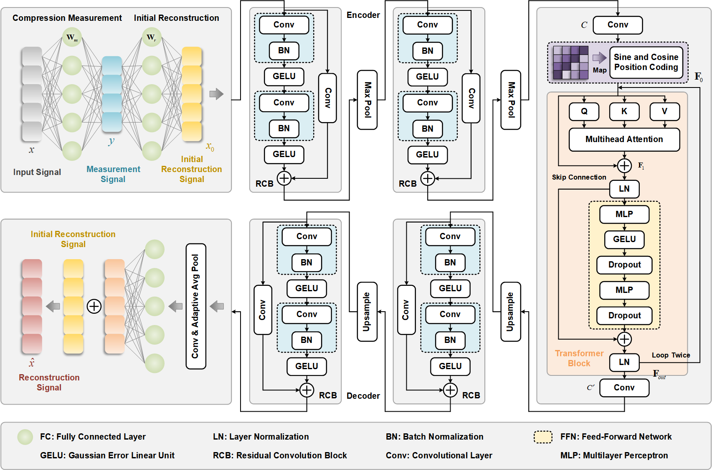
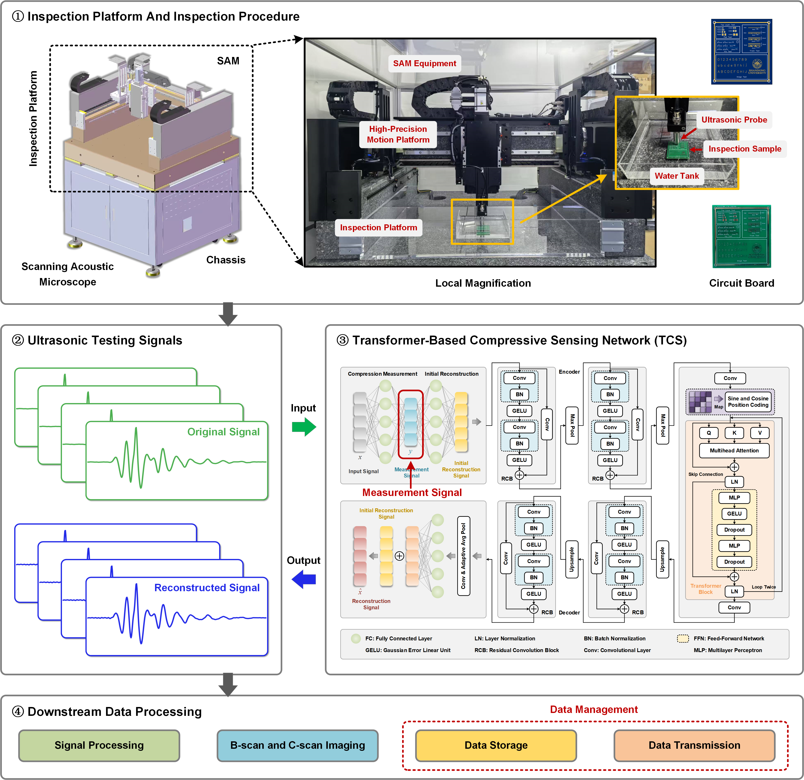

# SAM-TCS

Transformer-Based Compressive Sensing Network (SAM-TCS)

This code comes from the paper：SAM-TCS: A CNN–Transformer Compressive Sensing Network for High-Frequency Ultrasonic Signal Reconstruction in Scanning Acoustic Microscopy

